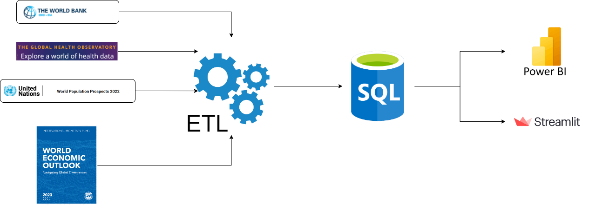
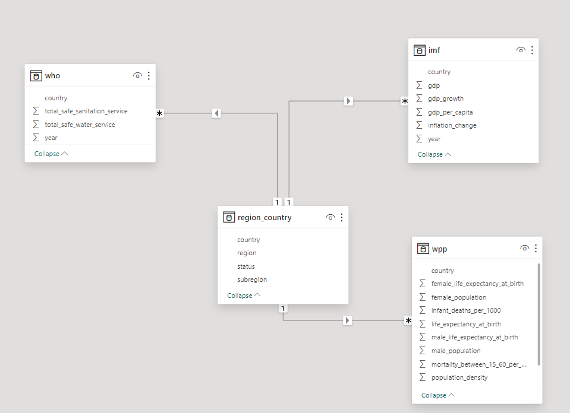

# BusinessAnalytics20231
# Group 2 - Problem 8 - IT4063E
---
- [Group 2 - Problem 8 - IT4063E](#group-2---problem-8---it4063e)
  - [Introduction](#introduction)
  - [Project Structure](#project-structure)
  - [System Architecture](#architecture)
  - [Prerequisite](#prerequisite)
  - [Dashboard](#dashboard)

## Introduction
Life expectancy is a critical indicator of health in a certain country (or region). This metric depends not only on the level of medicine in that country but also on its environmental conditions, economic and political context, and social tendencies.Analyzing the correlation between gross domestic product (GDP) per capita and life expectancy is a good idea for your next business analyst project. 
Our project aims to answer the following questions:
- For each geographic unit, is there a clear correlation between GDP per capita and life expectancy?
- What are the geographic units with the highest and lowest life expectancy? What about their GDP?
- What other potential issues could take place in the geographic units with a lower life expectancy?
- In general, is life expectancy in the modern world growing? And GDP?
## Project Structure
```bash
.
│   .gitignore
│   deployment.py
│   README.md
│   requirement.txt
│   tree.txt
│   
├───data
│   │   Life_Expectancy_Data.csv
│   │   region_country.csv
│   │   
│   ├───economy
│   │       gdp.csv
│   │       gdp_growth.csv
│   │       gdp_per_capita.csv
│   │       inflation_change.csv
│   │       
│   ├───health_data
│   │       health_expenditure_over_gdp.csv
│   │       health_expenditure_per_capita.csv
│   │       sanitation_services.csv
│   │       water_services.csv
│   │       
│   ├───integrated
│   │       integrated_data.csv
│   │       integrated_data_fillna.csv
│   │       
│   └───population_data
│           country_area.csv
│           income_group.csv
│           region.csv
│           subregion.csv
│           world.csv
│           
├───data_processing
│       data_cleaning.ipynb
│       data_integration.ipynb
│       
├───images
│       dashboard.png
│       schema.png
│       system.png
│       
├───models
│       ARIMA.ipynb
│       linearregression_xgboost.ipynb
│       
└───system
        upload_csv.ipynb
```

## System Architecture



## Prerequisite
* Python >= 3.10
* streamlit
* sklearn
* xgboost

## Power BI Dashboard

**General Dashboard**
